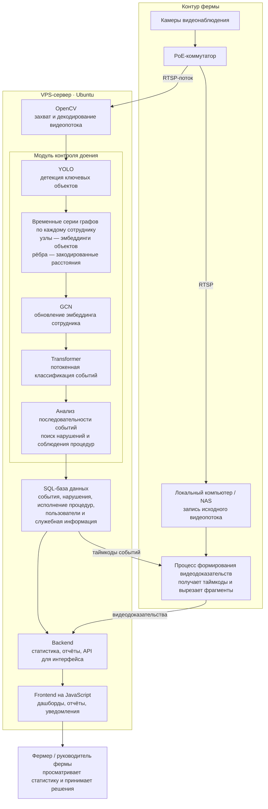

## 1. Инфраструктурный контур

IP-камеры установлены в функциональных зонах фермы: доильном зале, проходных коридорах, зоне кормового стола и других участках, необходимых для работы отдельных модулей.

Камеры подключены к локальной сети через PoE-коммутаторы и передают видеопоток по протоколу RTSP.

Архитектура разделена на два контура:

- локальный контур хранения видео на стороне фермы;
- серверный контур обработки видеопотока и ML-инференса.

Локальный NAS настроен для:

- непрерывной записи исходного видеопотока;
- хранения видеоархива;
- получения таймкодов событий из базы данных;
- формирования и сохранения видеодоказательств.

Основной ML-инференс выполняется на VPS-сервере под управлением Ubuntu. Захват и декодирование RTSP-потоков реализованы с использованием OpenCV.

Общий контур обработки:

> IP-камеры → PoE-коммутатор → RTSP → OpenCV на VPS → ML-модели → SQL-база данных → backend → frontend

Контур хранения видео:

> IP-камеры → NAS → видеоархив → нарезка фрагментов по таймкодам → видеодоказательства

## 1. Общая схема

## 2. Модуль контроля доения

Модуль распознаёт действия сотрудников и контролирует соблюдение технологического протокола доения.

### Детекция объектов

YOLO обрабатывает видеопоток в реальном времени и детектирует:

- сотрудников;
- оборудование;
- инструменты;
- объекты, связанные с выполнением процедур доения.

Для каждого объекта формируются:

- класс;
- координаты bounding box;
- confidence score;
- эмбеддинг.

### Графовое представление сцены

Для каждого сотрудника формируется отдельный граф.

Структура графа:

- узлы — сотрудник и связанные с ним объекты;
- признаки узлов — эмбеддинги объектов;
- рёбра — пространственные связи между объектами;
- признаки рёбер — закодированные расстояния.

Последовательность кадров преобразуется во временной ряд графов для каждого сотрудника.

### Классификация событий

Каждый узел графа имеет собственное векторное представление. Несколько слоёв GCN обновляют представление узла сотрудника с учётом признаков соседних узлов и связей между ними. В результате исходный эмбеддинг сотрудника дополняется контекстом окружения: расположенными рядом объектами, оборудованием и характером взаимодействия с ними.

Обновлённые представления сотрудника для последовательных временных шагов передаются в Transformer как последовательность токенов. Transformer выполняет покадровую классификацию событий, связанных с конкретным сотрудником.

GCN и Transformer обучены совместно как единая end-to-end архитектура. Модель учитывает:

- пространственные связи;
- временную динамику;
- порядок операций;
- продолжительность этапов;
- взаимодействие сотрудника с объектами.

### Анализ последовательности

Распознанная последовательность событий сопоставляется с эталонным протоколом доения.

Система определяет:

- выполнение обязательных операций;
- корректность порядка действий;
- пропуск этапов;
- нарушение временных нормативов;
- сотрудника, камеру и временной интервал события.

Результаты сохраняются в SQL-базе данных.

## 3. Общий CV-контур для анализа животных

Модули выявления хромоты и половой охоты находятся в проработке. Для них спроектирован общий конвейер:

> детекция → трекинг → реидентификация → анализ поведения → агрегация событий

В проектной архитектуре предусмотрены:

- YOLO — детекция животных;
- ByteTrack — многобъектный трекинг;
- ResNet-50/101 — извлечение ReID-эмбеддингов;
- EfficientNet-B0 или MobileNet-V3 — классификация поведения;
- HDBSCAN — кластеризация эмбеддингов неизвестных животных.

## 4. Детекция и трекинг животных

Компонент находится в проработке. YOLO используется для детекции животных, а ByteTrack — для связывания детекций между кадрами и построения устойчивых траекторий. Полученные треки используются при оценке двигательной активности, реидентификации и анализе поведения.

## 5. Реидентификация животных

Компонент находится в проработке. ReID-модель на основе ResNet формирует эмбеддинг животного по устойчивым признакам окраса и геометрии корпуса. Идентификация выполняется сравнением текущего эмбеддинга с эталонными представлениями в базе данных по косинусной близости. HDBSCAN используется для кластеризации ранее неизвестных животных.

## 6. Модуль выявления хромоты

Модуль находится в проработке и анализирует характер движения животного в проходной зоне.

Конвейер включает:

1. детекцию и трекинг животного;
2. реидентификацию;
3. извлечение признаков движения;
4. классификацию степени отклонения;
5. агрегацию результата по животному.

Анализируются асимметрия движения, скорость, длина и частота шага, положение корпуса и изменение траектории. Результат включает идентификатор животного, оценку отклонения, confidence score, временную метку и ссылку на видеофрагмент.

## 7. Модуль выявления половой охоты

Модуль находится в проработке и анализирует временные ряды двигательной активности и социального поведения.

Основные сигналы:

- рост активности относительно индивидуального базового уровня;
- изменение траектории движения;
- группирование животных;
- садки;
- повторяемость событий в заданном временном окне.

После агрегации сигналов система формирует идентификатор животного, временной интервал, confidence score, уведомление и ссылку на видеодоказательство.

## 8. Модуль контроля кормового стола

Модуль находится в проработке и основан на сегментации изображения кормового стола.

Модель выделяет области доступного корма, пустые участки, остатки и неанализируемые зоны. На основе последовательности сегментационных масок рассчитываются доля доступного корма, длительность отсутствия корма, изменение площади кормовой массы и проблемные секции. При выходе показателей за допустимые пороги формируется событие и связанный видеофрагмент.

## 9. Хранение данных

SQL-база данных хранит:

- конфигурацию камер;
- пользователей и роли;
- события ML-моделей;
- нарушения протокола;
- идентификаторы сотрудников и животных;
- временные метки;
- confidence scores;
- агрегированные показатели;
- ссылки на видеодоказательства.

Исходное видео и сформированные фрагменты хранятся на NAS.

После регистрации события ML-модуль записывает в базу:

- тип события;
- идентификатор камеры;
- время начала;
- время окончания;
- идентификатор сотрудника или животного;
- confidence score.

Процесс на NAS получает таймкоды, вырезает соответствующий фрагмент и сохраняет его в файловом хранилище.

## 10. Backend

Backend обеспечивает:

- приём результатов инференса;
- запись событий в SQL-базу;
- агрегацию статистики;
- формирование отчётов;
- управление таймкодами;
- связывание событий с видеофрагментами;
- передачу данных пользовательскому интерфейсу;
- управление пользователями и правами доступа.

Для модуля контроля доения backend рассчитывает:

- долю соблюдения протокола;
- количество нарушений;
- частоту нарушений по типам;
- показатели по сотрудникам;
- динамику по сменам;
- продолжительность отдельных операций.

## 11. Frontend

Frontend реализован на JavaScript и взаимодействует с backend через API.

Пользовательский интерфейс включает:

- дашборды;
- отчёты по сменам;
- список событий и нарушений;
- карточки сотрудников и животных;
- динамику показателей;
- уведомления;
- видеодоказательства;
- экспорт отчётов.

## 12. Итоговая схема

Основной контур:

> Камеры → PoE → RTSP → OpenCV на VPS → ML-инференс → SQL → backend → frontend

Контур видеодоказательств:

> Камеры → NAS → видеоархив → таймкоды из SQL → нарезка фрагмента → frontend

Основные вычисления выполняются на VPS-сервере. Локальный NAS используется для записи исходного видео и формирования видеодоказательств. Количество камер и вычислительные ресурсы определяются конфигурацией фермы, набором подключённых модулей и требуемым покрытием зон наблюдения.

