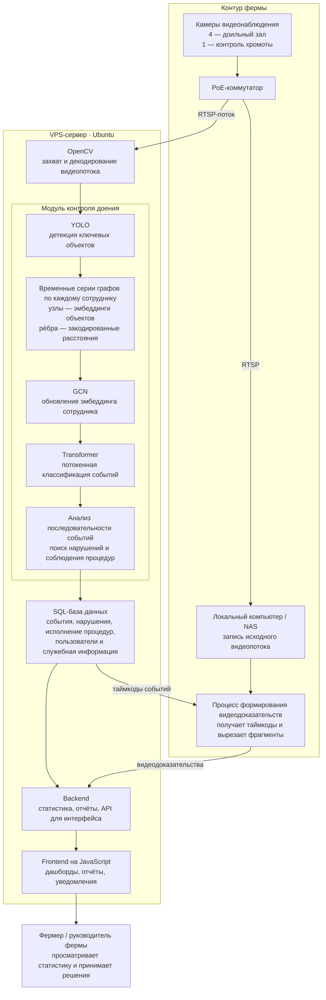

# Архитектура системы

Железо: на ферме стоят несколько камер: 4 для доильного зала, 1 - для хромоты. Они подключены через PoE коммутатор к сети и транслируют видео по RTSP протоколу.

Также на ферме расположен компьютер (NAS), записывающий видеопоток. На нем запущен процесс который принимает таймкоды из базы данных и вырезает и сохранят видеодоказательства. Вычисления производятся на VPS сервере (Ubuntu). Видео поток захватывается и декодируется при помощи OpenCV.

## 1. Общая схема

## Архитектура модуля контроля доения

1. На видеопотоке в реальном времени работает YOLO (детекция ключевых объектов).

2. Для каждого найденного человека строится отдельный граф, содержащий эмбеддинги для объектов (узлов) и закодированные дистанции в качестве признаков ребер. Для каждого работника создается отдельная серия временная серия графов.

3. Для каждой серии графов работает модуль предсказания событий: несколько слоев GCN создают обновленный эмбеддинг для сотрудника (работает изолированно для графа). Полученные эмбеддинги становятся токенами на взод трансформера (по токенная классификация событий привязанных к каждому работнику). GCN и трансформер обучаются вместе как единая архитектура.

4. Последовательности событий анализируются. Информация о нарушениях (или об их отсутствии) записывается в SQL базу данных.

База данных хранит информацию о исполнению процедур доения, содержит информацию о пользователях и прочую информацию. Back-end модуль собирает статистику и подготавливает отчеты. Также является backend для пользовательского интерфейса. Пользовательский интерфейс (frontend) предоставляет клиент написанный на JavaScript.
